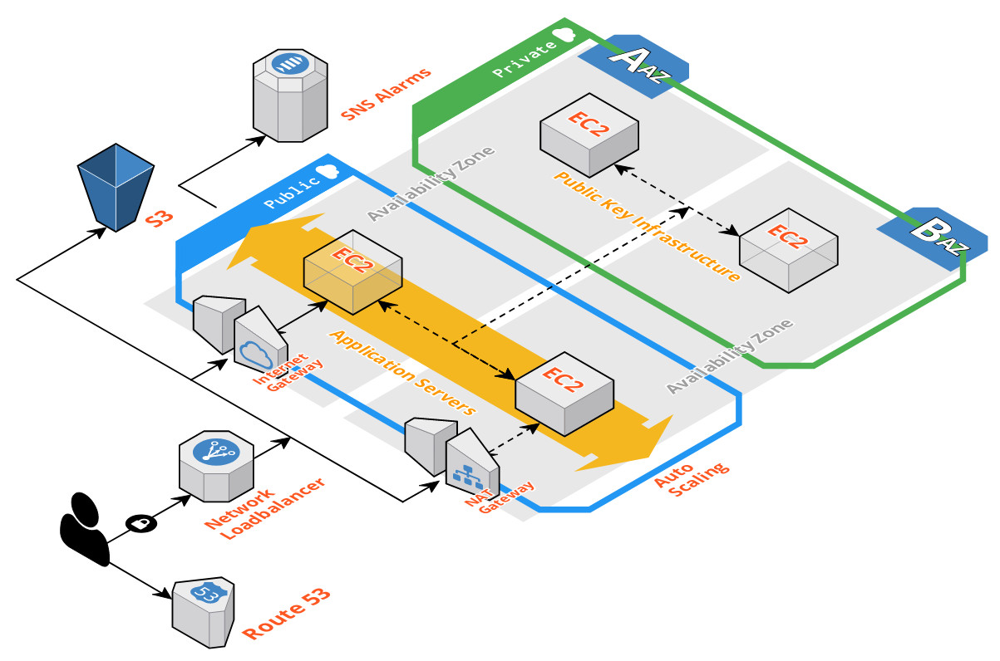

# A Cloud-based Virtual Private Network Application.

> Orchestrating AWS Infrastructure via the AWS Command Line Interface and Cloudformation.

A highly available, OS hardened, multi-client, dual protocol OpenVPN application server accompanied by an isolated Public Key Infrastructure certification authority.

