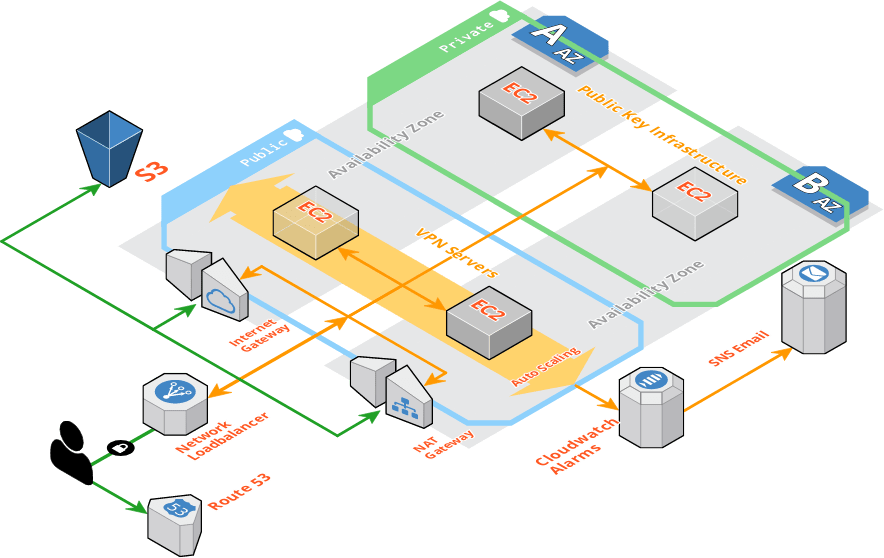
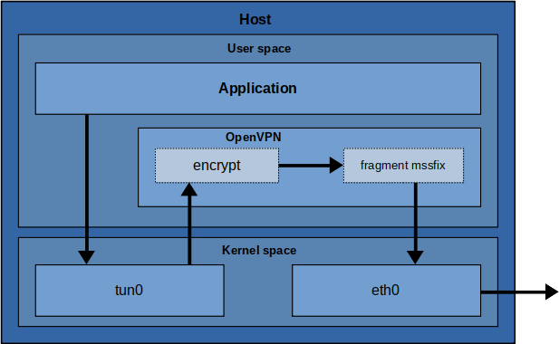
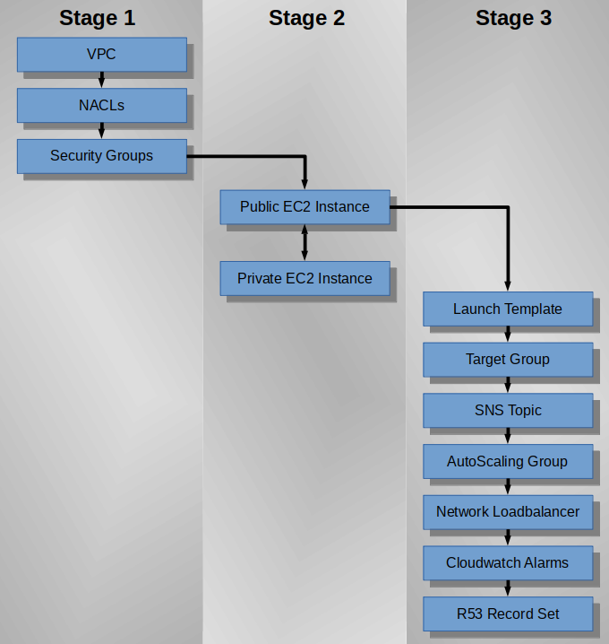

# cfn-ovpn-cli

> A virtual private network application in the AWS Cloud.

<p>
  
</p>

A hardened, fault-tolerant and highly-available, multi-client, dual-protocol, Cloud-based VPN appliance; accompanied by an isolated Public Key Infrastructure framework; orchestrated in Cloudformation via the AWS Command Line Interface.

[](https://github.com/cloudemprise/cfn-ovpn-cli)

[](https://github.com/stedolan/jq)
[](https://github.com/aws/aws-cli)
[](https://www.gnu.org/licenses/gpl-3.0)


**********

<p>
  
</p>

**Disclaimer:**<br/>
This Document is a work-in-progress. Some sections maybe absent or incomplete.

**********

## Prerequisites

- an AWS account with poweruser access.
- ssh key in infrastructure build Region.
- a Route 53 Hosted Zone.
- jq version 1.6
- awscli version 2
- bash > version 4

**********

<details>  
  <summary><b>Click to View Sample CLI Output:</b></summary>

  <p align="center">
    
  </p>

</details><br/>

**Full Demo CLI Output can be found Here**

**********

Table of Contents
=================

- [Introduction](#introduction)
- [OpenVPN](#openvpn)
- [Pulic Key Infrastructure](#public-key-infrastructure)
- [Cloudformation](#cloudformation)
- [Network Security](#network-security)
  * [AWS Network ACLs](#aws-network-acls)
  * [AWS Security Groups](#aws-security-groups)
  * [The Linux Kernel Packet Filter](#the-linux-kernel-packet-filter)
  * [Intrusion Prevention](#intrusion-prevention)
  * [sshd Hardening](#sshd-hardening)
- [System Hardening](#system-hardening)
  * [Access Management](#access-management)
  * [AWS Instance Metadata Service](#aws-instance-metadata-service)
  * [Package Management](#package-management)
- [Telemetry](#telemetry)
  * [Amazon CloudWatch Logs](#amazon-cloudwatch-logs)
  * [rsyslog](#rsyslog)
- [Error Handling](#error-handling)
- [Conclusion](#conclusion)
- [To Do List](#to-do-list)

**********

## Introduction

**cfn-ovpn-cli** is a shell script that creates a Cloud-based Virtual Private Network (VPN) application as well as an isolated Public Key Infrastructure (PKI) Certification Authority (CA). This gives rise to a secure personal mobile Wi-Fi roaming solution. The AWS Command Line Interface (AWS CLI) is employed to provision and configure various AWS resources through an assortment of API calls and AWS Cloudformation templates.

##### What follows is an overview of the program structure:

The first part of the shell script requests an assortment of parameters from the Script-Caller; pertaining to the project prerequisites and other program environment variables. Before any further processing or API calls are made, some rudimentary error checking and validation is performed on the project environment to pick up on any silly mistakes or obvious errors.

The next part of the script then builds a mix of IAM Control Access Policies and EC2 Instance Profiles of least privilege as well as operating system, utility and client configuration files. These artefacts and other significant project documents are then uploaded into Cloud Storage as reference material for further operational activities as well as an archive of record.

The Cloud infrastructure provisioning process now commences and takes the form of a three stage AWS CloudFormation Stack creation and update procedure. The First-Stage involves the provisioning of the idempotent architectural elements while the Second-Stage comprises the creation of two custom configured interrelated Golden Amazon Machine Image (AMI) snapshots. Each of which, represents either the Public or Private component of the system; namely the internet facing OpenVPN Server and the isolated PKI framework element, respectively. The final piece of the puzzle, i.e. Third-Stage is the creation of a fault-tolerant, auto-scaling, load-balanced server appliance based off of the preconfigured Public Golden AMI snapshot. 

Lastly, the script generates and collates locally, an assortment of OpenVPN client configuration archives for convenient distribution.

**********

## OpenVPN

#### Introduction

[OpenVPN](https://openvpn.net) is a popular open source VPN daemon that is both flexible and relatively easy to setup. It employs a multiclient-server architecture that is particularly well suited for small to mid-sized business deployments and is able to pass through NAT gateways and firewalls with easy.

OpenVPN incorporates the concept of a control channel and a data channel, both of which are encrypted and secured differently but transverse over the same link. 

Furthermore, OpenVPN uses a virtual network adapter as an interface between the user-level OpenVPN software and the underlying operating system.

> To do: Confidentiality Integrity Authentication

#### Networking

Acting as an interface between user-space and kernel-space, OpenVPN operates at the back-end of a software-defined network adapter, refered to as the Universal TUN/TAP Driver. This coupling can function as either a fully virtualized Ethernet adapter for any type of Layer 2 traffic (i.e. tap-style), or as a point-to-point connector operating in client-server mode for IP-only traffic (i.e. tun-style) operating at Layer 3. 

**cfn-ovpn-cli** is configured for IP-only traffic in tun-style mode for both the TCP as well as the UDP protocols. Conceptually, the tun-style adapter can be illustrated as follows:

<p align="center">
  
</p>

The flow of a single packet can be described succinctly as follows:

- a user-space application off-loads a packet to the operating system (OS).
- using nornal routing rules the OS decides the packet is destined for the VPN TUNnel.
- the packet is then forwarded to the kernel tun device.
- the kernel tun device then forwards the packet to the user-space OpenVPN process.
- the OpenVPN process encrypts and signs the packet, fragments it if necessary, and then hands it back to the kernel to be sent to the address of the remote VPN endpoint.
- the kernel picks up the encrypted packet and forwards it to the remote VPN endpoint, where the same process is carried out in reverse.

A consequence of this back-and-forth packet-scuffle is a performance bottleneck, in terms of both bandwidth and latency, making speeds above 1GB/s impractical.

#### Encryption

To setup a secure connection OpenVPN uses the [Transport Layer Security](https://en.wikipedia.org/wiki/Transport_Layer_Security) (TLS) cryptographic protocol to exchange keys and acquires its cryptographic back-end capabilities from the [OpenSSL](https://en.wikipedia.org/wiki/OpenSSL) encryption library.

By using Hash-based Message Authentication Code (HMAC) computations OpenVPN is able to verify both the data integrity and the authentication of a message simultaneously.

OpenVPN uses the OpenSSL library to provide encryption of both the control and data channels. It lets OpenSSL do all the encryption and authentication work, allowing OpenVPN to use all the ciphers available in the OpenSSL package. It can also use the HMAC packet authentication feature to add an additional layer of security to the connection, referred to as an "HMAC Firewall". 

#### Protocol

Give an overview here of the handshake and tunnel protocols.
Question here from the Security Interview Questionair about TLS ... 

#### Authentication
#### Security
#### Extensibility

**********

## Public Key Infrastructure

https://en.wikipedia.org/wiki/Pre-shared_key

A secure VPN requires authentication and this here involves two components:

1. Client/Server Authentication. This ensures that the server and clients are indeed communicating with authorized known entities and not some spoofed fake user/host.

2. A method of hashing each data packet within the system is also established. By authenticating each data packet, the system avoids wasting cpu cycles on decrypting packets that do not meet the authentication rules. Thus preventing many types of attack vectors.

A system that uses key-based authentication requires a Public Key Infrastructure (PKI). Simply put, a PKI consists of the following:

* A public master Certificate Authority (CA) certificate and a Private Key.
* A separate Public Certificate and Private Key pair for the server.
* A separate Public Certificate and Private Key pair for each client.

Conveniently, a awesome utility exist just for the purposes of making PKI management really easy, namely [Easy-RSA](https://github.com/OpenVPN/easy-rsa). Easy-RSA is a framework for managing X.509 PKI. It is based around the concept of a trusted root signing authority and the backend is comprised of the OpenSSL cryptographic library.

**cfn-ovpn-cli** builds two interrelated PKIs on hardened virtual linux servers within a VPC in the AWS Cloud. A trusted root CA is created within the isolated private subnet instance, only accessible via a Bastion Host and used exclusively to sign certificate requests. A second PKI is created on the OpenVPN application server itself which resides within the public subnet of the VPC. Here the server as well as the client certificates and Private Keys are generated. Requests and Signed Certificates are intelligently exchanged between these two systems by way of Cloudformation Stack Updates. 


This is described in more detail in the [Cloudformation](#cloudformation) section but suffice to say here, it hinges around the calling of the ec2 create-image API. The CA is further constrained by a passphrase that is securely stored and retrived via the AWS System Manager Parameter Store secrets management protocol. The elliptical curve secp521r1 key exchange cipher was chosen for smaller key size equivalence and faster execution performance.

> To do: Explain the issue surrounding <export RANDFILE=/tmp/.rnd>

**********

## Cloudformation

AWS Cloudformation is a service that provisions and configures Cloud resources that are declared in a template file. The template defines a collection of elements as a single unit called a Stack, simplifying the management of Cloud infrastructure.

**cfn-ovpn-cli** composes a monolithic hierarchical tree structure of nested Cloudformation Stacks, the orchestration of which is achieved in a three-stage Stack creation/update process that is promoted via a counter variable. The crux of the mater is, as noted above, the creation of two custom preconfigured interrelated Golden Amazon Machine Image (AMI) snapshots. The flowchart below illustrates the build process and resouce dependencies:

  <p align="center">
    
  </p>

> To DO: Explain how: Requests and Signed Certificates are intelligently exchanged between these two systems by way of Cloudformation Stack Updates. 

**********

## Network Security

Defense in depth is adopted to provide redundancy and is discussed in more details under the following headings.

#### AWS Network ACLs

Amazon VPC offers a network access control list (NACL) element that provides for an optional layer of security in the form of a stateless firewall, acting at the subnet layer. 

**cfn-ovpn-cli** assembles an ordered set of rules for its public as well as its private subnets. These two NACLs grant only the necessary inbound source or outbound destination routes for their respective privileged or unprivileged ports. All other traffic is denied from even entering the virtual network itself. 

#### AWS Security Groups

While NACLs operate at the network subnet level, security groups act at the instance level. An instane is a unit of compute capacity, eg. virtual machine, container or database etc. Conceptually, a secutity group can be thought of as a virtual statefull firewall, surrounding some computational unit, i.e. instance. 

A collection of unordered rules decide whether to allow traffic to reach the computation unit or not. An interesting feature of security groups is that they can reference other security groups as their end-point, exhibiting object like characteristics that simplifying rule creation and management.

**cfn-ovpn-cli** constructs two security groups, a Public Security Group for instances residing on public subnets and similarly, a Private Security Group for instances residing on private subnets. Restrictive rules are applied to ensure only expected traffic is allowed to pass through the computational units.

#### The Linux Kernel Packet Filter

iptables is a user-space utility program that can configure the Linux kernel packet filtering framework as well as NAT and other packet mangling tasks. Various modules can be side-loaded to extend its complex filtering capabilities. 

During Stage-2 of the Cloudformation Stack build process, **cfn-ovpn-cli** installs and configures iptables in a statefull posture within the Public and Private Virtual Linux Servers. Strict rules delineate distinct traffic domains for localhost services, the AWS instance metadata service (IMDS) and forwarded NAT VPN client traffic. As a precautionary measure VPN clients are denied routes to the local LAN.

* input pings are open to the world but rate limited
* input ssh is also rate limited
* ntp only allow to IMDS

#### Intrusion Prevention

fail2ban is an intrusion prevention system that safeguards against network brute-force attacks. It operates in conjunction with 
the Linux kernel packet filter, i.e. iptables and monitors log files for selected entries to block offending hosts. **cfn-ovpn-cli** configures a standard filter for sshd on port 22 in aggressive mode.

To Do : OpenVPN filter.

#### sshd Hardening

**cfn-ovpn-cli** not only utilizes an external-facing public EC2 instance as a VPN server but also as a Bastion Host, specifically providing access to the PKI residing within its private network. Because of its exposure to potential attacks, the onus is to minimize any chance of penetration, increase the defense of the system and reduce any potential risks from zero day exploits.

Pertaining to the the Golden Image _Amazon Linux 2_, only non-default settings are discussed here.

- The following straightforward changes are made to the default configuration:

| keyword-argument | Description |
| :---- | :--- |
| `X11Forwarding no` | X11 forwarding is an insecure feature and thus disabled. |
| `PermitRootLogin no` | Root login is denied. |
| `AllowUsers ec2-user` | The default linux system user account enabled only. |
| `LogLevel VERBOSE` | Comprehensive logging enabled. |

- The following settings combined, explicitly deny all forms of authentication except for Public Key:

| keyword-argument | Description |
| :---- | :--- |
| `AuthenticationMethods publickey` | Authentication method required for access granted. |
| `PubkeyAuthentication yes` | Public key authentication allowed |

- Together the following settings bring about an auto-disconnect feature for idle or inactive ssh sessions:

| keyword-argument | Description |
| :---- | :--- |
| `ClientAliveCountMax 0` | Disable keep-alive pings. |
| `ClientAliveInterval 600` | 10 min. inactive timeout interval. |

- Automatic security updates are routinely applied as discussed in the section on [Package Management](#package-management).
- Pursuant to [RFC8270](https://tools.ietf.org/html/rfc8270) and other endorsed infosec [recommendations](https://infosec.mozilla.org/guidelines/openssh), Diffie-Hellman moduli of less than 3072 bits are not recommended. As such short moduli are deactivated. 
- **cfn-ovpn-cli** does not require sftp support, therefore it is disabled.

**********

## System Hardening

The goal of systems hardening is to reduce security risk by eliminating potential attack vectors.

**cfn-ovpn-cli** uses the _Amazon Linux 2_ operating system which is based on Red Hat Enterprise Linux (RHEL). It provides a secure, stable and highly performant execution environment as it has been specifically optimized for Cloud computing. It is associated with a long-term security maintenance policy and is tightly integrated with many Amazon Web Services.

Of particular importance, the Amazon EC2 service utilizes a distributed storgage scheme that has at hand various encryption services that secure data at rest and in transit, as well as encrypting snapshots and instances. As **cfn-ovpn-cli** makes use of encryption wherever possible, these capabilities are leveraged to improve the security posture of the system as a whole.

_Amazon Linux 2_ uses `chrony` as its time synchronization service client. By default, `chrony` configures the _Network Time Protocol_ to use both the **Amazon Time Sync Service**, offered on the link local 169.254.169.123 IP address, as well as public servers accessible via the `pool.ntp.org` project. In the interest of attack surface reduction the public servers are disabled. Firewall routes are delineated accordingly.

* IMDSv2

Ancillary: As is discussed else where, Security Groups, iptables also offer lines of defense.
Include bash function aliases to authorize my ip.

### Access Management

AWS IAM (_Identity and Access Management_) is an authentication and authorization web service that is tightly integrated into every facet of the AWS Cloud. It allows for the central management of Access Controls to all AWS services and resources. At the heart of the matter is what is called a Policy Document that defines permissions. It is associated with either an identity or a resource and stipulates what actions are allowed, or not allowed by that identity or resource.

Of particular note, is a special identity refered to as an IAM Role. It is intended to be assumed by an entity (user, application or service), granting temporary security credentials to perform some limited task. When that entity is an EC2 Instance it is refered to as an Instance Profile.

As illustrated below, templates are used to create three project-specific policy document types that implement the best practice of Least Privilege:

```bash

policies/
├── s3-buckets
│   └── template-s3-bucket-policy.json
├── ec2-role
│   ├── template-pub-s3-access-policy.json
│   ├── template-priv-ssm-access-policy.json
│   ├── template-priv-s3-access-policy.json
│   └── template-lt-s3-access-policy.json
└── cfn-stacks
    ├── template-stage3-cfn-stack-policy.json
    ├── template-stage2-cfn-stack-policy.json
    └── template-stage1-cfn-stack-policy.json

```

| Policy Document  | Type | Description
| :----: | :---: | :---
| S3 Bucket | Resource based | Grants access permissions to the calling script identity for a remote storage container and the objects within.
| IAM Role | Identity based | Attached to Instance Profiles to delineate what actions can or can not be perform by the EC2 instance itself. 
| Cloudformation Stack | Special case | A Fail-safe mechanism that defines protected resources from unintentional updates during a Stack update procedure.

### AWS Instance Metadata Service

The AWS _Instance Metadata Service_ (IMDS) is a special link-local endpoint available on every EC2 instance where static as well as dynamic information related to the instance itself, as well as its network and its storage can be retrieved by any HTTP client. 

Of crucial importance is the fact that this metadata also yields the security credentials associated with the IAM Instance Profile. For example:

```
$ curl http://169.254.169.254/latest/meta-data/identity-credentials/ec2/security-credentials/ec2-instance/
{
  ...
  "AccessKeyId" : "ABCDEFGHIJKLMNOPQRST",
  "SecretAccessKey" : "ABCDEFGHIJKLMNOPQRSTUVWXYZ1234567890ABCD",
  "Token" : "...ABCDEFGHIJ...",
  ...
}
```

Notice how transparent the process is. 


The IMDS is available in two versions that are cross compatible:


| Version  | Method | Validation
| :----: | :---: | :---
| IMDSv1 | request/response | Unauthenticated. (default)
| IMDSv2 | session-oriented | Authenticated.


As per above, IMDSv1 is not protected by any authentication or cryptographic methods and as such, is completely open to any user or process running within the system. Four known vulnerabilities exist that could be exploited in an attempt to access the IMDS maliciously. These are as follows:

1. Misconfigured-open website application firewalls.
2. Misconfigured-open reverse proxies.
3. Unpatched server-side request forgery vulnerabilities.
4. Misconfigured-open layer-3 firewalls and network address translations.

**cfn-ovpn-cli** is particularly concerned with number 4 above as the linux kernel packet filter, i.e. iptables is used extensively throughout this application. 

IMDSv2 mitigates for these mentioned shortcomings by requiring, a cleaverly devised, authentication token to be submitted with every service call. A simple HTTP PUT request to IMDSv2 with a TTL hop of 1 will retrieve an ephemeral token.

**cfn-ovpn-cli** disables, by way of its EC2 Auto Scaling Group Launch Template, the use of IMDSv1 and as a added protection, is futher restricted to only root processes accessing the IMDSv2 service through firewall rules. As a consequence and aside note, the functionality of the useful utility [EC2 Instance Connect](https://docs.aws.amazon.com/AWSEC2/latest/UserGuide/Connect-using-EC2-Instance-Connect.html) is rendered invalid here because it operates without elevated privileges. 


### Package Management

Keeping **cfn-ovpn-cli** up-to-date is important because it improves the overall stabiltity of the system by ensuring that critical patches to security holes are applied in a timely manner. It also ensures that bugs are fixed and outdated features are regularly removed, making the nature of the offered service more beneficial.

By default, _Amazon Linux 2_ instances launch with the following repositories enabled:

| Repository | Description |
| :----: | :---: |
| `amzn2-core` | Amazon Linux 2 core repo |
| `amzn2extra-docker` | Amazon Extras repo for docker |

`amzn2extra-docker` is not required and thus disabled.

The Extra Packages for Enterprise Linux (`epel`) repository is a non-standard but popular archive managed by the Fedora Project. It is compatible with _Amazon Linux 2_ and contains the various auxillary packages required by **cfn-ovpn-cli**.

Due to packages perhaps being held by more than one repository, `yum-plugin-priorities` is used to enforce ordered protection between conflicting repositories. `epel` is thus set at a lower priority to `amzn2-core`.

The `yum-cron` service is configured to automatically keep the system up-to-date.
**********

## Telemetry

The _Amazon Linux 2_ Golden Image uses _systemd-journald_ as well as _rsyslog_ for event logging. Important log streams are configured, assembled and dispatched to _Amazon CloudWatch Logs_ and the _systemd_ journal is made persistent across reboots. To restrict the volume of local log data, the utility _logrotate_ is configured to compress, rotate and eventually truncate the relevant streams.

### Amazon CloudWatch Logs

Amazon CloudWatch Logs is a web service that provides aggregation and analysis tools for distributed message logging systems. **cfn-ovpn-cli** utilizes _Cloudformation_ to install and configure a _Unified CloudWatch Agent_ that facilitates the collection and retention of operational log events. The Agent is authorized by the IAM _CloudWatchAgentServerPolicy_ managed policy.

### rsyslog

For improved parsing and assisted analysis, **cfn-ovpn-cli** configures custom log-streams for the linux kernel packet filter (`iptables`) as well the for both the VPN daemon protocol activities. These are diverted to a separate log facility for forwarding to _Amazon Cloudwatch Logs_.

**********

## Error Handling

Talk about health-checks etc.
Health checks are done via the load  balancer and unfortunately I had to install a webserver in order to do health checks. Because vpn port ignores unmatch HMACs is it possible to install cert on load balancer so that health can be determined from the actual vpn app itself?

**********

## Conclusion

Lorem ipsum dolor sit amet, consectetur adipiscing elit, sed do eiusmod tempor incididunt ut labore et dolore magna aliqua. Ut enim ad minim veniam, quis nostrud exercitation ullamco laboris nisi ut aliquip ex ea commodo consequat. Duis aute irure dolor in reprehenderit in voluptate velit esse cillum dolore eu fugiat nulla pariatur. Excepteur sint occaecat cupidatat non proident, sunt in culpa qui officia deserunt mollit anim id est laborum.

**********

## To Do List

- OpenVPN client scripts
- Move iptables logs with Cloudwatch agent.
- partition iptables logs to S3 Bucket for Athena/Glue Catalogue search.
- fail2ban on port 1194
- implement block on port scanners with iptables -m recent reference archlinux doc.